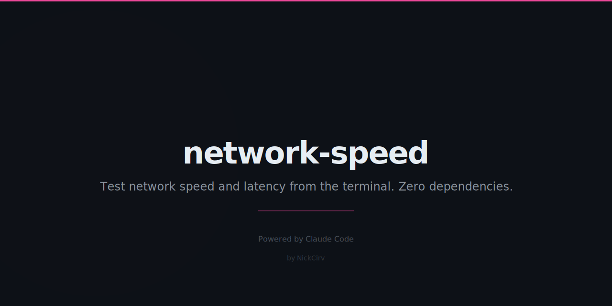

# network-speed

Test network download/upload speed and latency from the terminal. **Zero external dependencies** — built-in Node.js modules only.

```
network-speed v1.0.0  node v18+  darwin/arm64

Ping Test
  1.1.1.1      min 9.8ms   avg 22.5ms  max 49.7ms
  Cloudflare   min 10.4ms  avg 24.9ms  max 53.1ms
  Google       min 9.2ms   avg 22.6ms  max 62.0ms

Download Test  (10 MB from speed.cloudflare.com)
  ↓ Download [████████████████████████████] 100%     102.4 Mbps  10.0s

Upload Test  (10s to httpbin.org)
  ↑ Upload   [████████████████████████████] 100%      12.1 Mbps  10.0s

────────────────────────────────────────────────────────
  Download       102.4 Mbps       12.8 MB/s  🚀
  Upload          12.1 Mbps        1.5 MB/s  ⚡
  Ping            22.5 ms    best of 3 servers
────────────────────────────────────────────────────────
```

## Install

```bash
npm install -g network-speed
```

Or run without installing:

```bash
npx network-speed
```

## Usage

```
network-speed [options]
```

### Modes

| Command | Description |
|---------|-------------|
| `network-speed` | Full test: ping + download + upload |
| `network-speed --ping` | Latency test only |
| `network-speed --download` | Download speed only |
| `network-speed --upload` | Upload speed only |

### Options

| Flag | Default | Description |
|------|---------|-------------|
| `--server <url>` | Cloudflare/httpbin | Custom test server base URL |
| `--size <mb>` | `10` | Download test file size in MB |
| `--duration <s>` | `10` | Upload test duration in seconds |
| `--isp` | off | Show ISP, city, country, and public IP |
| `--json` | off | Output results as JSON |
| `--simple` | off | One-line summary: `↓ 102.4 Mbps ↑ 12.1 Mbps 🏓 22ms` |
| `--version`, `-v` | — | Show version |
| `--help`, `-h` | — | Show help |

## Examples

```bash
# Full test
network-speed

# Ping only
network-speed --ping

# Download a 50MB file to test throughput
network-speed --download --size 50

# Upload test for 20 seconds
network-speed --upload --duration 20

# Show ISP info
network-speed --isp

# Machine-readable JSON output
network-speed --json

# One-line status (great for scripts/dotfiles)
network-speed --simple

# Use a custom test server
network-speed --server https://my-server.example.com

# Ping only as JSON (for scripting)
network-speed --ping --json
```

### JSON output

```json
{
  "version": "1.0.0",
  "timestamp": "2026-03-03T09:38:03.665Z",
  "platform": "darwin",
  "arch": "arm64",
  "nodeVersion": "v25.2.1",
  "ping": {
    "bestMs": 22.48,
    "targets": [
      { "label": "1.1.1.1", "host": "one.one.one.one", "minMs": 9.85, "avgMs": 22.48, "maxMs": 49.75 },
      { "label": "Cloudflare", "host": "cloudflare.com", "minMs": 10.41, "avgMs": 24.91, "maxMs": 53.15 },
      { "label": "Google", "host": "google.com", "minMs": 9.22, "avgMs": 22.55, "maxMs": 61.99 }
    ]
  },
  "download": {
    "mbps": 102.4,
    "MBps": 12.8,
    "bytes": 10485760,
    "durationSec": 0.82,
    "server": "Cloudflare",
    "rating": "🚀"
  },
  "upload": {
    "mbps": 12.1,
    "MBps": 1.51,
    "bytes": 15204352,
    "durationSec": 10.02,
    "rating": "⚡"
  }
}
```

## Speed ratings

| Rating | Speed |
|--------|-------|
| 🐢 | < 5 Mbps |
| 🐇 | 5–25 Mbps |
| ⚡ | 25–100 Mbps |
| 🚀 | > 100 Mbps |

## How it works

- **Download**: Fetches bytes from `speed.cloudflare.com/__down` (or a custom server) via `https.get()`, measures throughput in real time
- **Upload**: POSTs random bytes (generated with `crypto.randomBytes()`) to `httpbin.org/post` in chunks for the specified duration
- **Ping**: TCP connect time (SYN→SYN-ACK) to `1.1.1.1:443`, `cloudflare.com:443`, and `google.com:443` — 5 samples per target, reports min/avg/max
- **ISP**: Optional lookup via `ip-api.com` (HTTP, no key required)

## Requirements

- Node.js >= 18
- No npm packages — uses only built-in modules: `https`, `http`, `net`, `url`, `crypto`, `os`

## License

MIT
